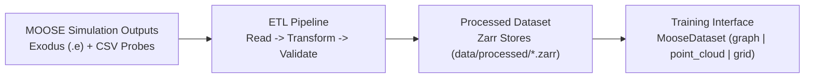

# TH_HOLO_workflow

TH_HOLO_workflow is a PhysicsNeMo-based ETL pipeline that converts MOOSE
thermal-hydraulics outputs (Exodus + CSV probes) into ML-ready Zarr datasets.

## TH_HOLO_workflow Plot



## What It Does

- Reads simulation outputs from Exodus `.e` files and CSV line-probe files.
- Normalizes fields and creates graph and regular-grid representations.
- Writes one compressed `.zarr` store per simulation run.
- Provides a PyTorch dataset interface for graph, point-cloud, and grid training.

## Quick Start

```bash
git submodule update --init --recursive
docker compose build etl-dev
docker compose run --rm etl-dev bash -lc 'cd src && python run_etl.py --config-name lid_driven'
```

The `lid_driven` config is defined in `src/moose_etl/config/lid_driven.yaml` and writes output to `data/processed/lid-driven/*.zarr`.

You can still override values on the command line if needed:

```bash
docker compose run --rm etl-dev bash -lc 'cd src && python run_etl.py --config-name lid_driven \
  etl.processing.num_processes=8'
```

To create a new dataset config, copy `src/moose_etl/config/lid_driven.yaml` to
`src/moose_etl/config/<your_config>.yaml`, update the source/sink paths, then run:

```bash
docker compose run --rm etl-dev bash -lc 'cd src && python run_etl.py --config-name <your_config>'
```

## Train an FNO with PhysicsNeMo

After ETL generates `*.zarr` stores, you can train a baseline FNO model.

Use the template config at `src/config/train_fno.yaml`:

```bash
docker compose build etl
docker compose run --rm etl bash -lc 'cd src && python train_fno.py --config config/train_fno.yaml'
```

Use `etl-ngc` instead of `etl` if you prefer the NGC PhysicsNeMo base image.
CLI flags override config values, for example:

```bash
docker compose run --rm etl bash -lc 'cd src && python train_fno.py --config config/train_fno.yaml --epochs 50'
```

## Evaluate an FNO Checkpoint

Use the template config at `src/config/eval_fno.yaml`:

```bash
docker compose run --rm etl bash -lc 'cd src && python eval_fno.py --config config/eval_fno.yaml'
```

## Documentation

### User docs

- [Getting Started (Docker setup, run modes, logs, troubleshooting)](docs/user/getting_started.md)

### Developer docs

- [ETL Pipeline Internals](docs/dev/etl_pipeline.md)
- [Dataset API](docs/dev/dataset.md)
- [FNO Training and Evaluation](docs/dev/fno_train_eval.md)
