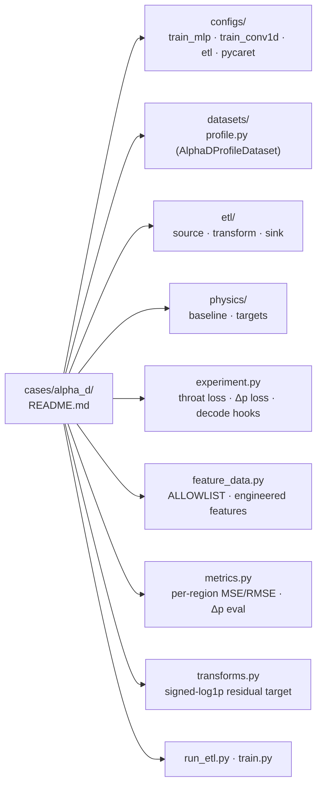

# Alpha-D Case

This page mirrors `src/cases/alpha_d/README.md` for the docs site. The
α_D surrogate predicts a per-station Darcy resistance coefficient along
a pipe contraction-expansion as a function of `(Re, Dr, Lr, z)`. Two
model variants share the same ETL + feature pipeline:

- **MLP (`train_mlp`)** — pointwise `FullyConnected` predicting one row
  at a time. HPO over ~10 hyperparameters is enabled by default.
- **Conv1D profile (`train_conv1d`)** — 1D convolutional surrogate that
  consumes the full 50-station profile per case. No HPO by default.

## Layout



Tree form (matches the on-disk listing):

```text
cases/alpha_d/
├── configs/           # Hydra YAMLs (train_mlp, train_conv1d, etl, pycaret)
├── datasets/          # AlphaDProfileDataset + build_dataset entry point
├── etl/               # PhysicsNeMo Curator pipeline (source, transform, sink)
├── physics/           # baseline, targets — alpha_D encoding + analytical baseline
├── experiment.py      # AlphaDExperiment — throat-weighted loss, Δp loss, decode hooks
├── feature_data.py    # ALLOWLIST, GROUPED_FEATURES, engineered_features_spec
├── metrics.py         # extended metrics (per-region MSE/RMSE, Δp evaluation)
├── transforms.py      # alpha_d_residual_transform (target = signed-log1p residual)
├── run_etl.py         # ETL entry point
├── train.py           # discoverability wrapper around the shared trainer
└── README.md          # source-of-truth, also rendered here
```

## End-to-end (from `src/`)

### 1. ETL — MOOSE to per-case Zarr

```bash
python cases/alpha_d/run_etl.py \
  etl.source.input_dir=../data/flow_contraction_expansion/parametric_study \
  etl.sink.output_dir=../data/flow_contraction_expansion/parametric_study/processed
```

Writes one `{case_name}.zarr` per simulation, each with a 50-station
feature/target matrix plus per-case metadata. See the
[Alpha-D Surrogate Tutorial](../user/alpha_d_surrogate.md) for the Zarr
layout and feature reference.

### 2. (Optional) PyCaret feature selection

```bash
python cases/alpha_d/run_feature_selection_pycaret.py
```

Reads the Zarr stores, runs PyCaret regression with the
`ALLOWLIST`-constrained candidate set, and writes
`selected_features.txt` for the MLP training config to pick up via
`data.input_columns_file`.

### 3. Train

=== "MLP (with HPO)"

    ```bash
    python train.py --config-path cases/alpha_d/configs --config-name train_mlp
    ```

=== "MLP (skip HPO)"

    ```bash
    python train.py --config-path cases/alpha_d/configs --config-name train_mlp hpo=null
    ```

=== "Conv1D profile"

    ```bash
    python train.py --config-path cases/alpha_d/configs --config-name train_conv1d
    ```

A discoverability wrapper exists for the MLP path:

```bash
python cases/alpha_d/train.py          # equivalent, but no HPO dispatch
```

Use the canonical `train.py` invocation when you need HPO.

### 4. Evaluate

```bash
python evaluate.py --config-path cases/alpha_d/configs --config-name train_mlp
```

`run_meta.json` written alongside the checkpoint reconstructs the exact
dataset, split, and `target_transform`, so the eval reproduces the
training conditions.

## Further reading

- [Alpha-D Surrogate Tutorial](../user/alpha_d_surrogate.md) — full
  walkthrough with feature reference and config knobs.
- [Hyperparameter Optimization](../user/hyperparameter_optimization.md)
  — HPO study layout and CLI overrides.
- [Case Distribution Analysis](../user/case_distribution_analysis.md) —
  pre-training data audit.
- [Repo Layout Refactor Plan](../dev/repo_layout_refactor_plan.md)
  (archived) — historical record of why this layout exists.
